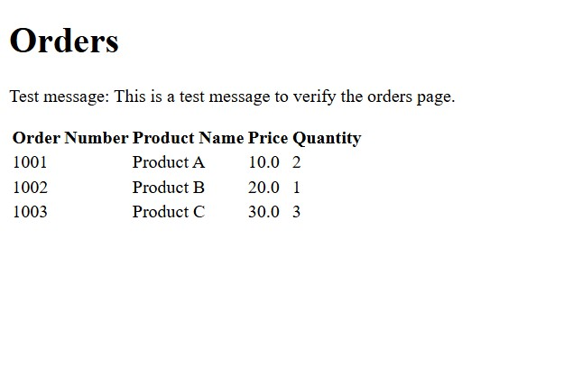
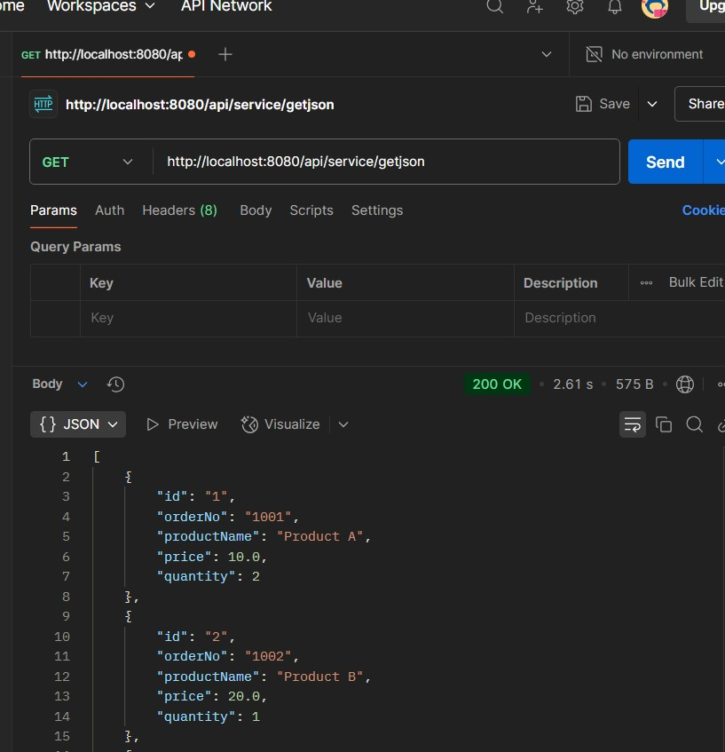
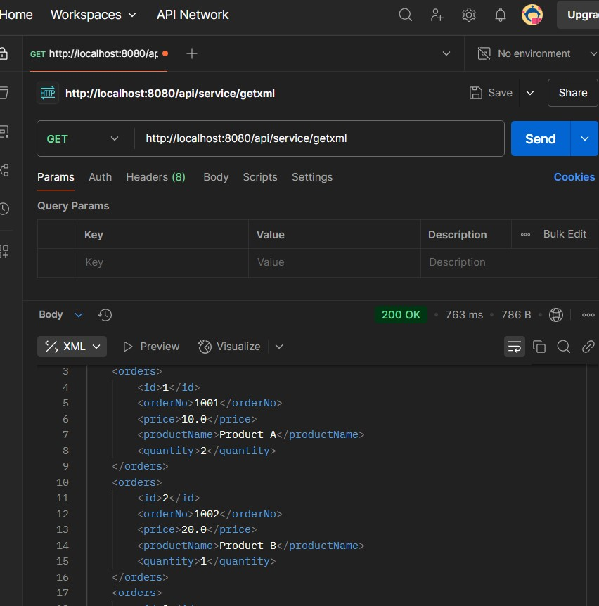
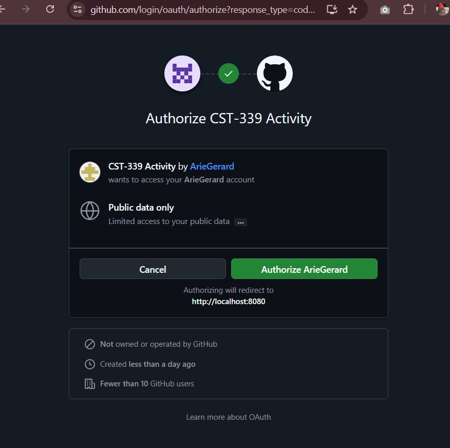
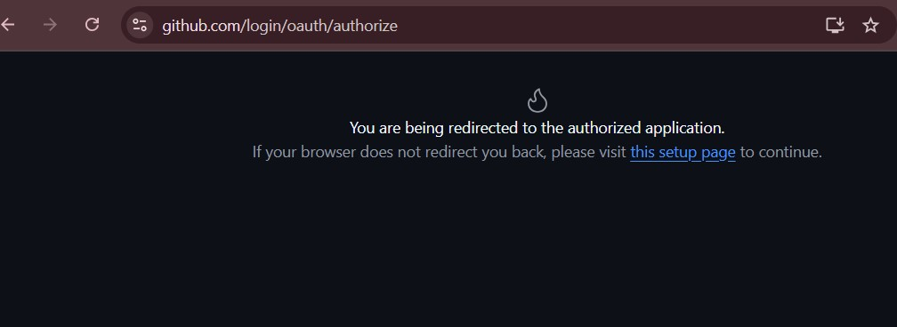

## Arie Gerard Activity 6
### Proffesor Etsy
----------
### 04/07/2025

## Part 1: Securing a Web Application Using an In-Memory Datastore.

#### Screenshot 1: Screenshot of the Orders page.

##### Description Screenshot of the OrdersPage After AUTH

#### Screenshot 2: Screenshot of the JSON and XML REST API responses.

##### Description Screenshot of the JSON response from postman 

##### Description Screenshot of the XML response from postman 

----
---
## Part 2: Securing a Web Application Using a Database

#### Screenshot 1: Screenshot of the Orders page.

##### Description Screenshot of the Orders Page using A database

#### Screenshot 2: Screenshot of the JSON and XML REST API responses.

##### Description Screenshot of the JSON response api 

##### Description screesnhot of the XML response api 

## Part 4: Securing REST APIs Using OAuth2 Authentication

#### Screenshot 1: Take a screenshot of the GitHub login screen.

##### Description Screenshot of the login window for github 

#### Screenshot 2: Take a screenshot of the API response after you have logged in using your GitHub credentials.

##### Description Screenshot of the API response after ive logged in using GitHub Creds 

### Reaserch Questions:

## Question 1:  Research the Forms Based authentication scheme. Describe how this works. Why it is important to use the Spring Security framework versus developing your own custom security framework?Forms-Based Authentication Scheme

Login Form: The user is presented with a login form where they enter their username and password.
Submission: The form submits the credentials to a server endpoint (e.g., /login).
Authentication:
The server validates the credentials against a user store (e.g., database, in-memory store).
If valid, the server creates a session for the user and stores the session ID in a cookie.
Session Management:
The session ID is sent with subsequent requests to identify the user.
The server uses the session ID to retrieve user details and grant access to protected resources.
Logout:
The user can log out, invalidating the session on the server.
Why It Is Important to Use Spring Security Framework:

Built-In Features:
Spring Security provides pre-built functionality for authentication, authorization, session management, and CSRF protection.
Customizability:
It allows customization of login forms, user stores, and security rules without reinventing the wheel.
Security Best Practices:
Implements industry-standard security practices, reducing the risk of vulnerabilities.
Integration:
Easily integrates with various authentication mechanisms (e.g., OAuth2, LDAP, JWT).
Time-Saving:
Developing a custom security framework is time-consuming and error-prone. Spring Security accelerates development with robust, tested components.
By using Spring Security, developers can focus on application logic rather than spending time building and maintaining a custom security framework.

## Question 2:Research the Basic HTTP authentication schema. Describe how this works. How does this technology help secure a REST API endpoint?
How It Works:

Credentials Encoding:

The client sends the username and password as a Base64-encoded string in the Authorization header of the HTTP request.
Example header:
Here, dXNlcm5hbWU6cGFzc3dvcmQ= is the Base64-encoded value of username:password.
Server Validation:

The server decodes the Base64 string to retrieve the username and password.
It validates the credentials against a user store (e.g., database, in-memory store).
Access Control:

If the credentials are valid, the server grants access to the requested resource.
If invalid, the server responds with a 401 Unauthorized status and may include a WWW-Authenticate header to prompt the client for credentials.
Stateless Authentication:

Basic authentication is stateless, meaning the server does not maintain session information. The client must send the Authorization header with every request.
How It Secures a REST API Endpoint:

Authentication:

Ensures that only users with valid credentials can access protected endpoints.
Simplicity:

Basic authentication is easy to implement and does not require cookies or session management, making it suitable for REST APIs.
Transport Layer Security (TLS):

When used over HTTPS, the credentials are encrypted during transmission, preventing interception by attackers.
Integration:

Works seamlessly with HTTP clients and tools like Postman, curl, and browser-based authentication prompts.
Limitations:

No Password Encryption:
The credentials are only Base64-encoded, not encrypted. Without HTTPS, they can be intercepted.
No Session Management:
The client must send credentials with every request, which can be inefficient.
Vulnerability to Replay Attacks:
If intercepted, the Base64 string can be reused by attackers.
Best Practices:

Always use HTTPS to encrypt the communication.
Combine Basic Authentication with other security mechanisms, such as IP whitelisting or API rate limiting.
Consider using more secure authentication methods (e.g., OAuth2 or JWT) for production systems.

