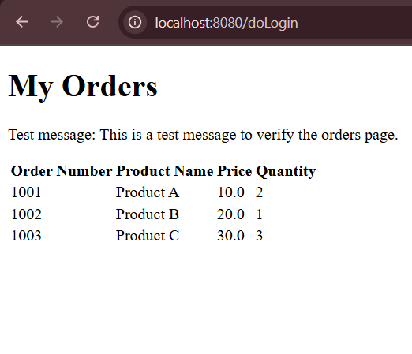
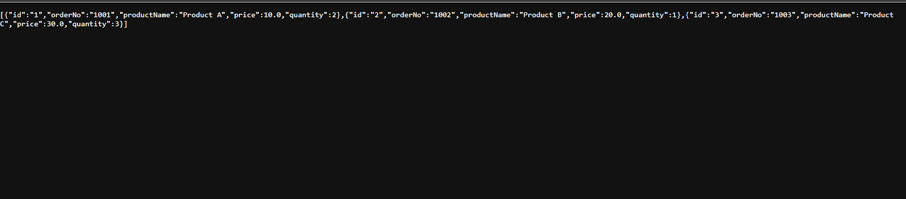
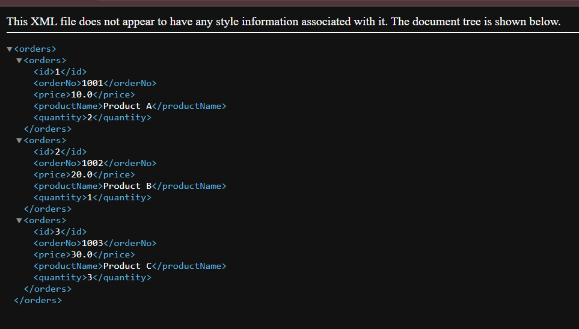
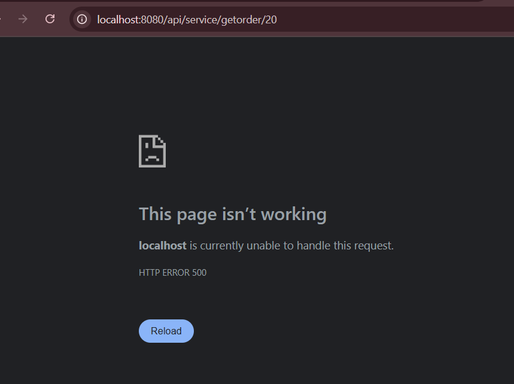

## Arie Gerard Activity 5
### Proffesor Etsy
----------
### 03/23/2025

## Part 1: Creating Data Services Using Spring Data MongoDB

#### Screenshot 1: Screenshot of the Orders Page Dispalying from the mongoDB database. 

#### Screenshot 2: Screenshot of the JSON and XML Rest API responses. 

- Description: Shows the JSON response for the Orders from the MongoDB database

- Description: Shows the XML response for the Orders from the MongoDB database

----
---
## Part 2: Adding New Queries in the MongoDB Repsoitory 

#### Screenshot 1: Screenshot of the JSON REST API response with a known ID 

- Description Shows teh Response page outprinting the XML response for a order with the correct ID 
----

#### Screenshot 2: Screenshot of the JSON REST API response with an invalid ID 

- Description: Shows a HTTPS error page when an invalid ID is inserted

### Reaserch Questions:

## Question 1:  Compare and contrast the design of schema in a relational database and a nonrelational database. How do they differ and what impact(s) does migrating from a relational database to a nonrelational database have on your application design?

- Structure: Relational databases use a structured Schema while nonrelational databases uses a more flexible schema. 

- Normalization: In a relational database normalization is used to reduce redunancy and ensure the data is intact while in a noSql database data is often denormalized to improve read preformance. 

### Impact of Migrating from Relational to Nonrelational Database:

- Data Modeling: The data Modeling approach changes from a structured normalized schema to a more flexible denormalized schema. 

- Querying: The way that the data is queried changes as they use different languages and APIs. 

## Question 2:Compare and contrast the features of a relational database and a nonrelational database. Provide three advantages and rationale for why you would select a relational database. Provide three advantages and rationale for why you would select a nonrelational database.

- Relational Database Features:

- ACID Transactions: Ensures data integrity and reliability through Atomicity, Consistency, Isolation, and Durability.

- Structured Query Language (SQL): Provides a powerful and standardized way to query and manipulate data.
Data Integrity: Enforces data integrity through constraints, foreign keys, and normalization.
- Advantages of Relational Database:
- Data Integrity: Ensures data accuracy and consistency, making it suitable for applications where data integrity is critical.
Rationale: Ideal for financial systems where data accuracy is paramount.
Complex Queries: Allows for complex queries, joins, and aggregations, facilitating data analysis and reporting.
Rationale: Beneficial for business intelligence tools that require complex data analysis.

- Nonrelational Database Features:
- Schema Flexibility: Allows for dynamic changes to the data structure without requiring a predefined schema.
Horizontal Scalability: Designed to scale horizontally, distributing data across multiple servers.
- Variety of Data Models: Supports various data models, including document, key-value, wide-column, and graph.
- Advantages of Nonrelational Database:
- Scalability: Designed to handle large volumes of data and high traffic loads by scaling horizontally.
- Rationale: Suitable for applications like social media platforms that require high scalability.
- Flexibility: Offers flexible schemas, allowing for rapid changes to the data structure.
- Rationale: Ideal for content management systems with evolving data requirements.
Performance: Provides high performance for specific use cases, such as handling large volumes of unstructured data or high read/write throughput.
- Rationale: Beneficial for real-time analytics or caching systems that require fast read/write operations.

